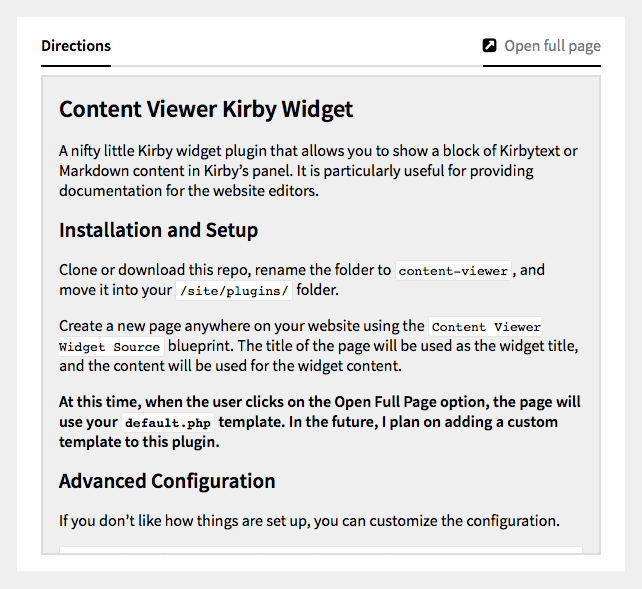

# Content Viewer Kirby Widget

A nifty little [Kirby](https://getkirby.com) widget that allows you to show a block of Kirbytext or Markdown content in Kirby's panel. It is particularly useful for providing documentation for website editors.

## Installation and Setup

Clone or [download](https://github.com/CalebGrove/content-viewer/archive/master.zip) this repo, rename the folder to `content-viewer`, and move it into your `/site/plugins/` folder. If you are using the [Kirby CLI](https://github.com/getkirby/cli), you can install it with this command:

	kirby plugin:install CalebGrove/content-viewer

Now, open up the panel and you should see the new widget on the dashboard. To change the content, click on the **Edit** button at the top-right of the widget. **This option will *only* be visible to users with the role of administrator.**

If you want to customize the CSS, you may do so by copying the  `styles.css` file from this plugin's `assets` folder to `/assets/plugins/content-viewer/styles.css`. Kirby will now serve your version of the file, and updating this plugin won't overwrite it.
